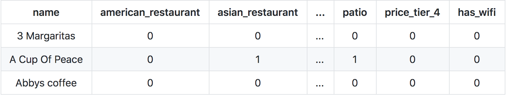
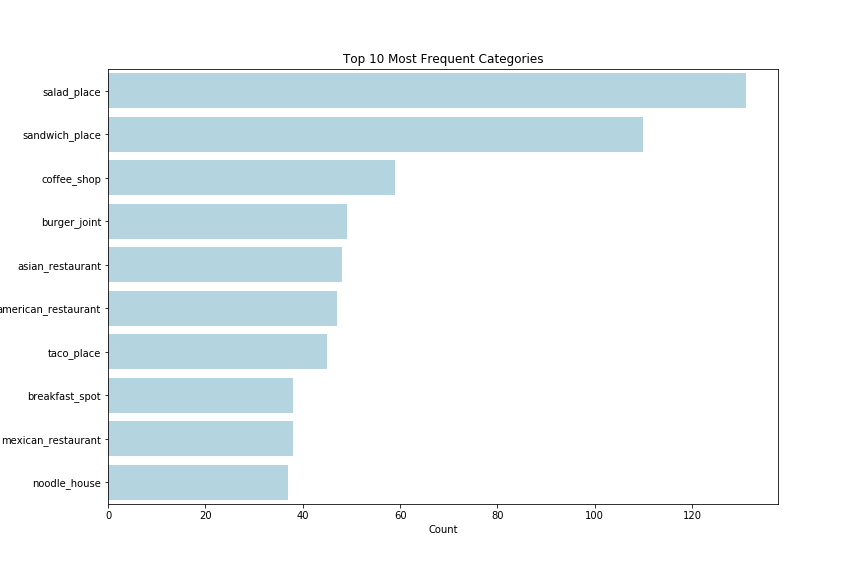
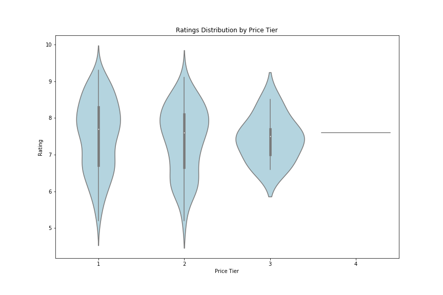
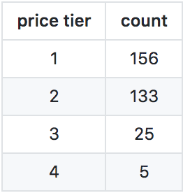

********************
# Exploring Boulder Restaurants
********************

Flask App: 
[link](https://developer.foursquare.com/places-api)

## Table of Contents
1. [Background](#Background)
2. [Data](#Data) 
3. [Modeling](#Modeling)
4. [Results](#Results)
5. [Web App](#Web-App)
6. [Future Considerations](#Future-Considerations)

## Background 
### Context
For my capstone project, I worked with an early-stage startup in Boulder whose mission is to take the stress out of dining out by providing personalized recommendations. The startup has built connections with potential customers, so their next focus is to create a minimum viable product (MVP). 

### Objective
With the startup's initial target market being Boulder, my objective was to: 
* Gather and explore data on Boulder restaurants
* Build a dynamic, recommender system using machine learning techniques

## Data
### Cleaning & Processing
Foursquare Places API: 
[source](https://developer.foursquare.com/places-api)

Foursquare API is developer-friendly and its terms and conditions are more lenient compared to alternative API's. This component was important for the startup as it plans to scale and commercialize.  

To manipulate the data to a format I could use, it required JSON parsing through the Foursquare API data and converting it to a Pandas DataFrame. 

Initially there were 661 venues in Boulder on Foursquare but after cleaning for chain restaurants, repeats, closures and one-offs, my final dataset was comprised of **318 restaurants and 78 categories**. Categories were associations a restaurant would be described as both in regards to the food it serves as well as attributes not related to food. For example, common categories were *Mexican, Italian, and salad*, and common attributes were *patio, happy hour, does delivery, and price tier*.

<!-- | name        | american_restaurant | asian_restaurant |  ...  | patio | price_tier_4 | has_wifi |
| :----------:|:-------------------:|:----------------:|  ---  |:-----:|:------------:|:--------:|
| 3 Margaritas      | 0 | 0 | ... | 0 | 0 | 0 |
| A Cup Of Peace    | 0 | 1 | ... | 1 | 0 | 0 |
| Abbys coffee   |  0 | 0 | ... | 0 | 0 | 0 | -->

### Exploratory Data Analysis (EDA)
To understand the Foursquare data, I analyzed the categories and attributes represented in the Boulder restaurants. I looked at how common or uncommon categories were and explored relationships between numerical variables. Below are a few images providing an idea of the dataset. 

The following were the most common categories in Boulder. I used soft clustering, which allows a restaurant to be labeled as more than one category, opening the posibility to be grouped under multiple clusters or latent topics (which I discuss more in the modeling section below). Salads and sandwiches were the most frequent. And ethnic-specific cuisines, such as Ethiopian, were the least frequent (which I did not include as an image).

To explore the correlational relationships between variables, I explored the numerical data I had through Foursquare. They were ratings, likes, tips, listed and photos. After plotting a scatterplot matrix, I saw there was a strong positive correlation amongst the numerical variables. 

So instead of using all of them, I chose ratings to observe how the distribution of a numerical variable differed by price tier. 

An interesting finding here was that while ratings in price tier 1 and 2 were widely distributed with a mean rating 7.5 and 7.7, respectively, ratings overall were closer to the mean for price tier 3 at 8.1. This leads me to hypothesize that self-fulfilling prophesy may be involved when you go to a finer, more expensive restaurant. There were only 5 restaurants for price tier 4, including a few NaNs.

<!-- | price tier | count |
|:--------:|:-------:|
| 1 | 156 |
| 2 | 132 |
| 3 | 25 | 
| 4 |  5 |  -->

## Modeling

I chose Non-negative Matrix Factorization (NMF) topic modeling because of: 
* Sparcity 
* Speed 
* Soft Clustering

### Sparsity (or addressing it)
In my Foursquare dataset, it is all 1's and 0's of restaurants and the categories they are labeled as. Because each restaurant is labeled as only a handful of categories, there are many zeros all across the dataset. Despite having a sparse matrix, NMF is dynamic and works with this dataset to create latent topics. 

### Speed
NMF is extremely fast compared to other models. By creating a number of latent topics, through NMF you can use that number of latent topics to calculate a similarity or distance metric instead of using all 78 categories to vectorize and do so. NMF is also dynamic to create new matrices W and H, where W shows the loaded scores of each restaurant to a latent topic and H shows the loaded scores of each category to a latent topic.  

I selected my latent topics, k = 9. I plotted how the number of k influenced the reconstruction error, the comparison between the original matrix to the new matrix, V, created by NMF. After seeing that the greatest inflection point range, or the decrease in slope, was between 5 and 15, I analyzed the actual latent topics and the restaurants and categories under each topic. Finally, I made a judgment call at 9, where the topics were most sensible. 

# Challenges
  * working with nested JSON objects
  * limited premium calls
  
# Findings

### Overview:
147 categories, 483 restaurants, 20 features

### Categorical Data:
  * *Price Tier*
  * *Verified*
  * *Categories*
  * *Attributes*

### Numerical Data:
  * *Ratings*
  * *Likes*
  * *Tips Count*
  * *Listed*
  * *Photos Count*

### Textual Data: 
  * *Descriptions*
  * *Tips*
  * *Categories*
  * *Attributes*
  

"Grab a seat on the patio if you've got kids--there's a park just beyond the fence!
happy hour: 3-7
Everything! Love carnitas!
The best tacos west of the Mississippi and Norte del Mexico"

### Image Data:
  * *Photos*

# Future Steps
1. Gather user data and perform EDA
2. Expand analysis on dataframe in preparation for feature selection & modeling (i.e. NLP, Sentiment Analysis, Computer Vision, Multiple Regression)
3. Create database/data pipeline before scaling (i.e. MongoDB, Spark, AWS)
4. Webscrape Boulder Dining website, if needed

For Capstone 2, the focus was on identifying clusters of restaurant venues using unsupervising learning, specifically non-negative matrix factorization (NMF).
  
# Question: 
Using NMF, what unexpected clusters can we find amongst Boulder restaurants that we can use to make recommendations?

# Data
Foursquare Places API: 
[ source](https://developer.foursquare.com/places-api)

There are 615 Boulder restaurants in the dataset. While there are 147 possible categories a restaurant on Foursquare can be labeled as, only 73 of those categories are represented in Boulder restaurants. Also, each restaurant can be described by the attributes it has. In Boulder restaurants, 23 attributes are represented. 

Summary:
  * **96 total features** 
  * 73 categories (i.e. Mediterranean Restaurants, Cafes, etc)
  * 23 attributes (i.e. Outdoor seating, Happy Hour, Live Music, Wheelchair accessible, Price Tier 1-4, etc)
  * did not use numerical: likes, rating, photos, tips, listed

# Approach
  * Why did I choose NMF?
  * How did I choose the number of k's?
  
**Why NMF?**

Soft clustering. Because each of my restaurants can have multiple categories or features associated with them. 

**How did I choose my k?**

After running my algorithm, I calculated the **reconstruction error** at various points in k to find where there is the greatest dropoff. The goal is to have the reconstruction error minimized to a desired value. To help visualize this, here is an elbow plot:

While there isn't a clear drop-off point in the error at point k, there is a noticeable shift of the slope at **k = 10**. So I decided to use 10 as my number of k. 

# Findings

## By features:

* *latent topic 1:* cocktails, full bar, happy hour, beer, wine, reservations, american_restaurant, dinner, dessert, table_service

* *latent topic 2:* price tier 1, sandwich place, food truck, pizza place, fast food restaurant, café, coffee shop, mexican restaurant, ice cream shop, deli/bodega

* *latent topic 3:* restaurant, american_restaurant, mexican restaurant, price tier 3, fast food restaurant, dinner, chinese restaurant, asian restaurant, italian restaurant, french restaurant 

## My labels: 
* *topic 1:* **dinner and drinks**
* *topic 2:* **quick, cheap eats**
* *topic 3:* **fancier, unique sit-downs**

## By restaurants:

* *topic 1:* 
Cracovia Polish Restaurant and Bar, The Sink, Next Door Boulder, Jax Fish House Boulder, OAK at fourteenth
       
* *topic 2:* 
Nick-N-Willy's, Nick and Willy's Take And Bake Pizza, SUBWAY, SUBWAY, SUBWAY
       
* *topic 3:*
The North End at 4580, Boulder Chophouse & Tavern, chop shop casual urban eatery, River and Woods, Boulder Airport Taxi

By Feature and by Restaurants Comparison:
1. dinner and drinks --> **fancy night out on a weekend**
2. quick cheap eats --> **casual, cheap eats**
3. fancier, unique sit-down restaurants --> **refined American cuisine**
4. comfortable, mid-tier meal --> **reliable mid-tiers**
5. affordable unique --> **borderline affordable, unique experiences**
6. dunno --> **Italian**
7. varied --> **fancy sit-down restaurants**
8. fancy american --> **top-tier Euro-American restaurants**
9. coffee and meal --> **coffee and eat**
10. relaxed, casual -->  **coffee and sit**

## **The North End at 4580**
* **fancy night out on a weekend**:    0.115
* **casual, cheap eats**:    0.000
* **refined American cuisine**:    0.326
* **reliable mid-tiers**:    0.138
* **borderline affordable, unique experiences**:    0.000
* **Italian**:    0.000
* **fancy sit-down restaurants**:    0.265
* **top-tier Euro-American restaurants**:    0.234
* **coffee and eat**:    0.000
* **coffee and sit**:    0.000

# Next-Steps
1. Build on topic modelling concepts towards a collaborative recommender system
2. Create user-facing tool for recommender (i.e. Flask)
