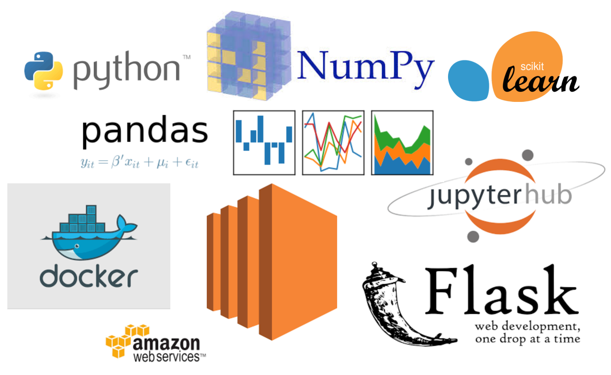
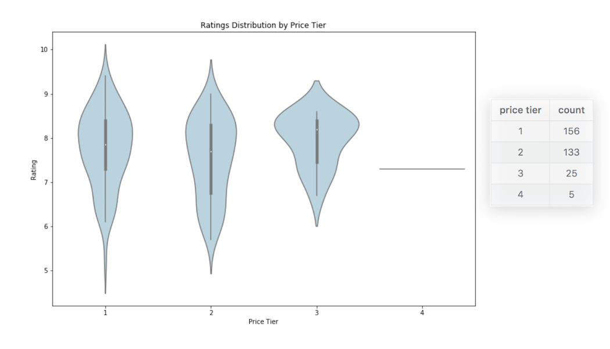
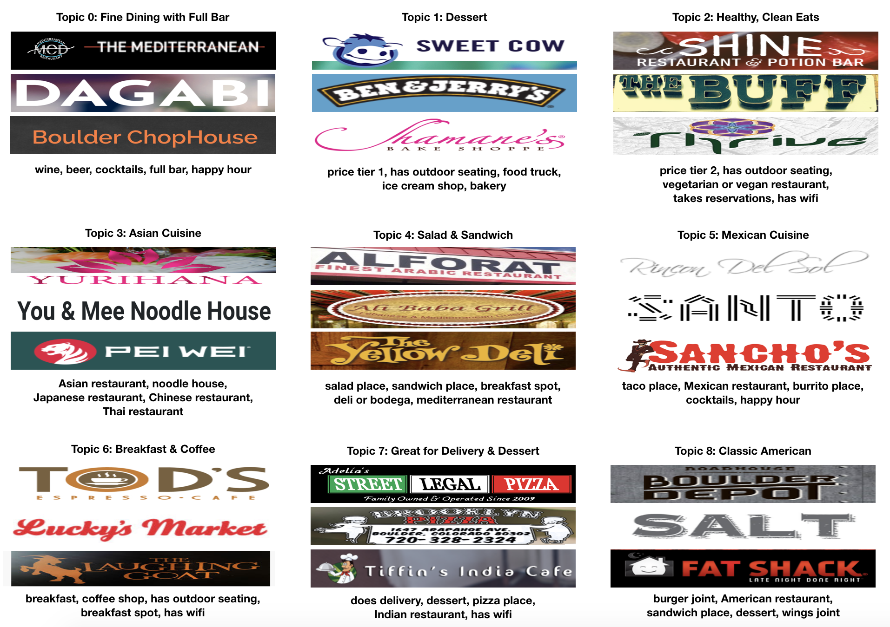
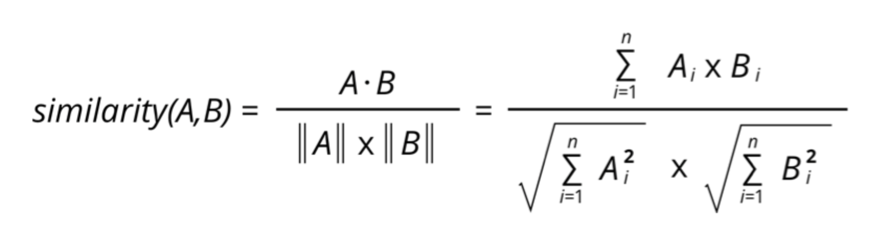

********************
# Exploring Boulder Restaurants
********************

Flask App: 
[link]<link>

## Table of Contents
1. [Background](#Background)
2. [Data](#Data) 
3. [Modeling](#Modeling)
4. [Results](#Results)
5. [Web App](#Web-App)
6. [Future Considerations](#Future-Considerations)

## Background 
### Context
For my capstone project, I worked with an early-stage startup in Boulder whose mission is to take the stress out of dining out by providing personalized recommendations. The startup has built connections with potential customers, so their next focus is to create a minimum viable product (MVP). 

### Objective
With the startup's initial target market being Boulder, my objective was to: 
* Gather and explore data on Boulder restaurants
* Build a dynamic, recommender system using machine learning techniques

## Tech Stack

## Data
### Cleaning & Processing
Foursquare Places API: 
[source](https://developer.foursquare.com/places-api)

Foursquare API is developer-friendly and its terms and conditions are more lenient compared to alternative API's. This component was important for the startup as it plans to scale and commercialize.  

To manipulate the data to a format I could use, it required JSON parsing through the Foursquare API data and converting it to a Pandas DataFrame. 

Initially there were 661 venues in Boulder on Foursquare but after cleaning for chain restaurants, repeats, closures and one-offs, my final dataset was comprised of **319 restaurants and 78 categories**. Categories were associations a restaurant would be described as both in regards to the food it serves as well as attributes not related to food. For example, common categories were *Mexican, Italian, and salad*, and common attributes were *patio, happy hour, does delivery, and price tier*.

<!-- | name        | american_restaurant | asian_restaurant |  ...  | patio | price_tier_4 | has_wifi |
| :----------:|:-------------------:|:----------------:|  ---  |:-----:|:------------:|:--------:|
| 3 Margaritas      | 0 | 0 | ... | 0 | 0 | 0 |
| A Cup Of Peace    | 0 | 1 | ... | 1 | 0 | 0 |
| Abbys coffee   |  0 | 0 | ... | 0 | 0 | 0 | -->

### Exploratory Data Analysis (EDA)
To understand the Foursquare data, I analyzed the categories and attributes represented in the Boulder restaurants. I looked at how common or uncommon categories were and explored relationships between numerical variables. Below are a few images providing an idea of the dataset. 

The following were the most common categories in Boulder. I used soft clustering, which allows a restaurant to be labeled as more than one category, opening the posibility to be grouped under multiple clusters or latent topics (which I discuss more in the modeling section below). Salads and sandwiches were the most frequent. And ethnic-specific cuisines, such as Ethiopian, were the least frequent (which I did not include as an image).

To explore the correlational relationships between variables, I explored the numerical data I had through Foursquare. They were ratings, likes, tips, listed and photos. After plotting a scatterplot matrix, I saw there was a strong positive correlation amongst the numerical variables. 

So instead of using all of them, I chose ratings to observe how the distribution of a numerical variable differed by price tier. 

An interesting finding here was that while ratings in price tier 1 and 2 were widely distributed with a mean rating 7.5 and 7.7, respectively, ratings overall were closer to the mean for price tier 3 at 8.1. This leads me to hypothesize that self-fulfilling prophesy may be involved when you go to a finer, more expensive restaurant. There were only 5 restaurants for price tier 4, including a few NaNs.

<!-- | price tier | count |
|:--------:|:-------:|
| 1 | 156 |
| 2 | 132 |
| 3 | 25 | 
| 4 |  5 |  -->

## Modeling

I chose Non-negative Matrix Factorization (NMF) topic modeling because of: 
* Sparcity 
* Speed 
* Soft Clustering

### Sparsity (or addressing it)
In my Foursquare dataset, it is all 1's and 0's of restaurants and the categories they are labeled as. Because each restaurant is labeled as only a handful of categories, there are many zeros all across the dataset. Despite having a sparse matrix, NMF is dynamic and works with this dataset to create latent topics. 

### Speed
NMF is extremely fast compared to other models. By creating a number of latent topics, through NMF you can use that number of latent topics to calculate a similarity or distance metric instead of using all 78 categories to vectorize and do so. NMF is also dynamic to create new matrices W and H, where W shows the loaded scores of each restaurant to a latent topic and H shows the loaded scores of each category to a latent topic.  

I selected my latent topics, k = 9. I plotted how the number of k influenced the reconstruction error, the comparison between the original matrix to the new matrix, V, created by NMF. After seeing that the greatest inflection point range, or the decrease in slope, was between 5 and 15, I analyzed the actual latent topics and the restaurants and categories under each topic. Finally, I made a judgment call at 9, where the topics were most sensible. 

### Soft Clustering
One of the advantages of NMF is soft clustering. Instead of strictly restricting each restaurant to be labeled as only one category or another, NMF allows multiple categories per restaurant. As a result, this allows a restaurant to fall under multiple clusters, which lead to rich, unexpected groupings of restaurants under topics. This was key in adding a serendipitious component to the recommendations, along with relevance and novelty. 

## Results

### Latent Topics, Restaurants, and Categories

Here are the 9 latent topics with the top three restaurants and top 5 categories for each topic. 

After seeing the topics, how do you think NMF did in creating the clusters? Personally, I think NMF did pretty well coming up with topics we would expect. You can observe the categories under each topic and come up with labels yourself - that part requires human judgment.

### Cosine Similarity

After coming up with the latent topics, NMF provides loaded score for each restaurant under each latent topics. Using the matrix W, I measured how similar each restaurant was to one another using cosine similarity. When a user inputs a restaurant, the web app provides the top three restaurants with the highest cosine similarity to the selected restaurant. 
  

## Web App

Try out the app yourself: <link> 

Here's an example of the home and results pages:

## Future Considerations

* If user ratings were accessible, consider using collaborative filtering method leveraging restaurant-restaurant and user-user similarity.
* If reliable text and description data were available, consider applications for NLP, tf-idf and LDA. 
* Combine multiple approaches towards a robust, hybrid recommender. 

## References

Aggarwal, C. (2016). Recommender systems. New York: Springer.