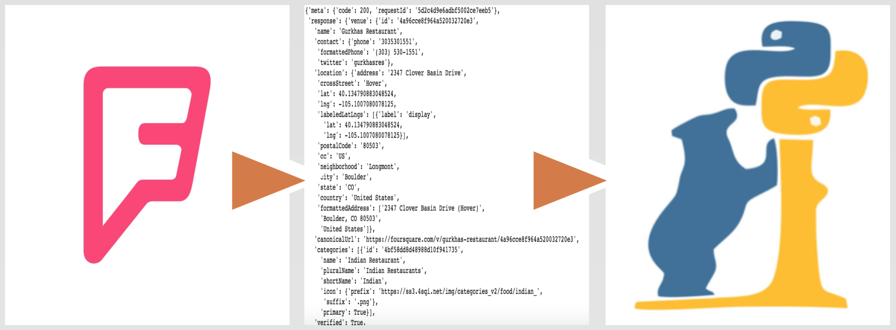
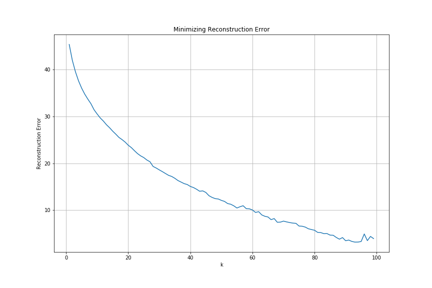

********************
# Exploring Boulder Restaurants
********************

Flask App: 
[link](https://developer.foursquare.com/places-api)

## Table of Contents
1. [Background](#Background)
2. [Data](#Data) 
3. [Modeling](#Modeling)
4. [Results](#Results)
5. [Web App](#Web-App)
6. [Future Considerations](#Future-Considerations)

## Background 
### Context
For my capstone project, I worked with an early-stage startup in Boulder whose mission is to take the stress out of dining out by providing personalized recommendations. The startup has built connections with potential customers, so their next focus is to create a minimum viable product (MVP). 

### Objective
With the startup's initial target market being Boulder, my objective was to: 
* Gather and explore data on Boulder restaurants
* Build a dynamic, recommender system using machine learning techniques

## Data
### Processing
Foursquare Places API: 
[source](https://developer.foursquare.com/places-api)

Foursquare API is developer-friendly and its terms and conditions are more lenient compared to alternative API's. This component was important for the startup as it plans to scale and commercialize.  

To manipulate the data to a format I could use, it required JSON parsing through the Foursquare API data and converting it to a Pandas DataFrame. 

After cleaning for chain restaurants, repeats, closures and one-offs, my final dataset was comprised of 318 restaurants and 78 categories. Categories were associations a restaurant would be described as both in regards to the food it serves as well as attributes not related to food. For example, common categories were *Mexican, Italian, and salad*, and common attributes were *patio, happy hour, does delivery, and price tier*.

| name        | american_restaurant | asian_restaurant |  ...  | patio | price_tier_4 | has_wifi |
| :----------:|:-------------------:|:----------------:|  ---  |:-----:|:------------:|:--------:|
| 3 Margaritas      | 0 | 0 | ... | 0 | 0 | 0 |
| A Cup Of Peace    | 0 | 1 | ... | 1 | 0 | 0 |
| Abbys coffee   |  0 | 0 | ... | 0 | 0 | 0 |

*The final dataset's shape was 318 x 78.* 

### Exploratory Data Analysis (EDA)

## 3 GET requests
  * *categories (147 total)*
  * *explore (uses keyword to return recommendations)*
  * *details (single query using venue unique id)*
  
Through the **categories GET** request, I gained insight about all of the categories used in the Foursquare app. It is divided up into main categories that serve as umbrella categories. And below those main categories, there are two levels of subcategories. For example, the main category I used for my GET request was 'Food'. And under 'Food' were subcategories, such as "Indian Restaurants", and "Mexican Restaurants", and under those subcategories were sub-level-2 categories, such as "Dosa", "South Indian", "North Indian", and "Taco Places" and "Burrito Places", respectively. In the dataset I used, under "Food", there were 90 subcategories and 56 sub-level-2 categories, for a total of 147 categories.

The **explore GET** request takes a keyword as an input and compares it against restaurants' associated categories and tips. The output is a specified number of venues, with a limit of 100. 

Lastly, the **details GET** request takes the unique id of a venue and runs a single query that returns all of the specific details for that single venue. Because it is a single query, I attained all of the categories from the categories GET request, ran a loop to get all of the restaurants associated with each category to get around the limit of 100 on explore. 

I created a set of all of the unique id's from the explore recommendations list and created another loop to run single queries using all of the unique id's gathered from the first two GET requests. **The resulting dataset was a dataframe with 483 rows and 20 columns.**

# Challenges
  * working with nested JSON objects
  * limited premium calls
  
# Findings

### Overview:
147 categories, 483 restaurants, 20 features

### Categorical Data:
  * *Price Tier*
  * *Verified*
  * *Categories*
  * *Attributes*

### Numerical Data:
  * *Ratings*
  * *Likes*
  * *Tips Count*
  * *Listed*
  * *Photos Count*

### Textual Data: 
  * *Descriptions*
  * *Tips*
  * *Categories*
  * *Attributes*
  

"Grab a seat on the patio if you've got kids--there's a park just beyond the fence!
happy hour: 3-7
Everything! Love carnitas!
The best tacos west of the Mississippi and Norte del Mexico"

### Image Data:
  * *Photos*

# Future Steps
1. Gather user data and perform EDA
2. Expand analysis on dataframe in preparation for feature selection & modeling (i.e. NLP, Sentiment Analysis, Computer Vision, Multiple Regression)
3. Create database/data pipeline before scaling (i.e. MongoDB, Spark, AWS)
4. Webscrape Boulder Dining website, if needed

For Capstone 2, the focus was on identifying clusters of restaurant venues using unsupervising learning, specifically non-negative matrix factorization (NMF).
  
# Question: 
Using NMF, what unexpected clusters can we find amongst Boulder restaurants that we can use to make recommendations?

# Data
Foursquare Places API: 
[ source](https://developer.foursquare.com/places-api)

There are 615 Boulder restaurants in the dataset. While there are 147 possible categories a restaurant on Foursquare can be labeled as, only 73 of those categories are represented in Boulder restaurants. Also, each restaurant can be described by the attributes it has. In Boulder restaurants, 23 attributes are represented. 

Summary:
  * **96 total features** 
  * 73 categories (i.e. Mediterranean Restaurants, Cafes, etc)
  * 23 attributes (i.e. Outdoor seating, Happy Hour, Live Music, Wheelchair accessible, Price Tier 1-4, etc)
  * did not use numerical: likes, rating, photos, tips, listed

# Approach
  * Why did I choose NMF?
  * How did I choose the number of k's?
  
**Why NMF?**

Soft clustering. Because each of my restaurants can have multiple categories or features associated with them. 

**How did I choose my k?**

After running my algorithm, I calculated the **reconstruction error** at various points in k to find where there is the greatest dropoff. The goal is to have the reconstruction error minimized to a desired value. To help visualize this, here is an elbow plot:

While there isn't a clear drop-off point in the error at point k, there is a noticeable shift of the slope at **k = 10**. So I decided to use 10 as my number of k. 

# Findings

## By features:

* *latent topic 1:* cocktails, full bar, happy hour, beer, wine, reservations, american_restaurant, dinner, dessert, table_service

* *latent topic 2:* price tier 1, sandwich place, food truck, pizza place, fast food restaurant, café, coffee shop, mexican restaurant, ice cream shop, deli/bodega

* *latent topic 3:* restaurant, american_restaurant, mexican restaurant, price tier 3, fast food restaurant, dinner, chinese restaurant, asian restaurant, italian restaurant, french restaurant 

## My labels: 
* *topic 1:* **dinner and drinks**
* *topic 2:* **quick, cheap eats**
* *topic 3:* **fancier, unique sit-downs**

## By restaurants:

* *topic 1:* 
Cracovia Polish Restaurant and Bar, The Sink, Next Door Boulder, Jax Fish House Boulder, OAK at fourteenth
       
* *topic 2:* 
Nick-N-Willy's, Nick and Willy's Take And Bake Pizza, SUBWAY, SUBWAY, SUBWAY
       
* *topic 3:*
The North End at 4580, Boulder Chophouse & Tavern, chop shop casual urban eatery, River and Woods, Boulder Airport Taxi

By Feature and by Restaurants Comparison:
1. dinner and drinks --> **fancy night out on a weekend**
2. quick cheap eats --> **casual, cheap eats**
3. fancier, unique sit-down restaurants --> **refined American cuisine**
4. comfortable, mid-tier meal --> **reliable mid-tiers**
5. affordable unique --> **borderline affordable, unique experiences**
6. dunno --> **Italian**
7. varied --> **fancy sit-down restaurants**
8. fancy american --> **top-tier Euro-American restaurants**
9. coffee and meal --> **coffee and eat**
10. relaxed, casual -->  **coffee and sit**

## **The North End at 4580**
* **fancy night out on a weekend**:    0.115
* **casual, cheap eats**:    0.000
* **refined American cuisine**:    0.326
* **reliable mid-tiers**:    0.138
* **borderline affordable, unique experiences**:    0.000
* **Italian**:    0.000
* **fancy sit-down restaurants**:    0.265
* **top-tier Euro-American restaurants**:    0.234
* **coffee and eat**:    0.000
* **coffee and sit**:    0.000

# Next-Steps
1. Build on topic modelling concepts towards a collaborative recommender system
2. Create user-facing tool for recommender (i.e. Flask)
