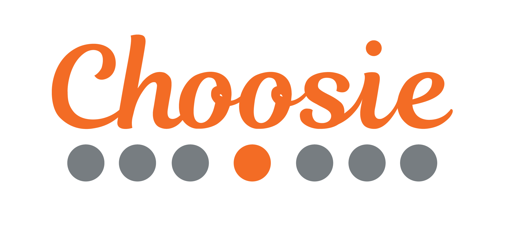

********************
# NMF Clustering for Restaurant
********************

## Table of Contents
1. [Background](#Background)
2. [Question](#Question)
3. [Data](#Data)
4. [Approach](#Approach)
5. [Findings](#Findings)
6. [Next Steps](#Next-Steps)

# Background 
Choosie's mission is to take the stress out of dining out. They aspire to achieve that by providing personalized recommendations, both for you and your group. The first target market is Boulder, CO. 

For Capstone 2, the focus was on identifying clusters of restaurant venues using unsupervising learning, specifically non-negative matrix factorization (NMF).

  
# Question: 
Using NMF, what unexpected clusters can we find amongst Boulder restaurants that we can use to make recommendations?

# Data
Foursquare Places API: 
[ source](https://developer.foursquare.com/places-api)

There are 615 Boulder restaurants in the dataset. While there are 147 possible categories a restaurant on Foursquare can be labeled as, only 73 of those categories are represented in Boulder restaurants. Also, each restaurant can be described by the attributes it has. In Boulder restaurants, 23 attributes are represented. 

Summary:
  * **96 total features** 
  * 73 categories (i.e. Mediterranean Restaurants, Cafes, etc)
  * 23 attributes (i.e. Outdoor seating, Happy Hour, Live Music, Wheelchair accessible, Price Tier 1-4, etc)
  * did not use numerical: likes, rating, photos, tips, listed

# Approach
  * Why did I choose NMF?
  * How did I choose the number of k's?
  
**Why NMF?**

Soft clustering. Because each of my restaurants can have multiple categories or features associated with them. 

**How did I choose my k?**

After running my algorithm, I calculated the **reconstruction error** at various points in k to find where there is the greatest dropoff. The goal is to have the reconstruction error minimized to a desired value. To help visualize this, here is an elbow plot:

While there isn't a clear drop-off point in the error at point k, there is a noticeable change shift of the slop at **k = 10**. So I decided to use 10 as my number of k. 

# Findings

By features:

latent topic 1: cocktails, full bar, happy hour, beer, wine, reservations, american_restaurant, dinner, dessert, table_service

latent topic 2: price tier 1, sandwich place, food truck, pizza place, fast food restaurant, café, coffee shop, mexican restaurant, ice cream shop, deli/bodega

latent topic 3: restaurant, american_restaurant, mexican restaurant, price tier 3, fast food restaurant, dinner, chinese restaurant,asian restaurant, italian restaurant, french restaurant

My labels: 
topic 1: **dinner and drinks**
topic 2: **quick, cheap eats**
topic 3: **fancier, unique sit-downs**

By restaurants:
1: 'Cracovia Polish Restaurant and Bar', 'The Sink', 'Next Door Boulder',
       'Jax Fish House Boulder', 'OAK at fourteenth'
       
2: 'Nick-N-Willy's', 'Nick and Willy's Take And Bake Pizza', 'SUBWAY',
       'SUBWAY', 'SUBWAY'
       
3: 'The North End at 4580', 'Boulder Chophouse & Tavern',
       'chop shop casual urban eatery', 'River and Woods',
       'Boulder Airport Taxi'
       
**The North End at 4580**
latent_topic_0    0.115
latent_topic_1    0.000
latent_topic_2    0.326
latent_topic_3    0.138
latent_topic_4    0.000
latent_topic_5    0.000
latent_topic_6    0.265
latent_topic_7    0.234
latent_topic_8    0.000
latent_topic_9    0.000

By Features:
1. **dinner and drinks**
2. **quick cheap eats**
3. **fancier, unique sit-down restaurants**
4. **comfortable, mid-tier meal**
5. **affordable unique**
6. **dunno**
7. **varied**
8. **fancy american**
9. **coffee and meal**
10. **relaxed, casual**

By Restaurants:
1. **fancy night out on a weekend**
2. **casual, cheap eats**
3. **refined american cuisine**
4. **reliable mid-tiers**
5. **borderline affordable, unique experiences**
6. **Italian**
7. **Fancy Sit-down restaurants**
8. **top-tier eruo-american restaurants**
9. **coffee and eat**
10. **coffee and sit**

# Next-Steps
1. Build on topic modelling concepts towards a collaborative recommender system
2. Create user-facing tool for recommender (i.e. Flash)
